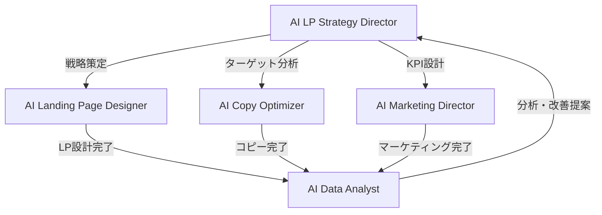

# 🎯 CV獲得ランディングページ制作チーム

> **AI Agents Miyabi** の高コンバージョン率LP制作に特化した自律型エージェントチーム

[](docs/CV-LANDING-PAGE-TEAM-GUIDE.md)
[](#業界別対応)
[](#期待成果)

## 🚀 クイックスタート

```bash
# 1. 基本デモ実行
node run-cv-demo.mjs

# 2. 業界別テンプレート確認
node run-cv-demo.mjs --templates

# 3. カスタムプロジェクト実行
node scripts/run-cv-team.js --industry=B2B-SaaS --goal=trial-signup --cvr=5.5
```

## 🎪 チーム構成

| エージェント | 役割 | 主要機能 |
|------------|------|----------|
| 🎯 **AI LP Strategy Director** | 戦略総監督 | CV戦略立案・ターゲット分析・競合分析・KPI設計 |
| 🎨 **AI Landing Page Designer** | LP設計専門家 | LP設計・CVR最適化・A/Bテスト・ヒートマップ分析 |
| ✍️ **AI Copy Optimizer** | コピー最適化専門家 | ヘッドライン・価値提案・感情トリガー・CTA最適化 |
| 📊 **AI Marketing Director** | マーケティング統括 | 集客戦略・チャネル最適化・予算配分・流入経路設計 |
| 📈 **AI Data Analyst** | 分析・改善専門家 | KPIダッシュボード・パフォーマンス分析・改善提案 |

## 🏢 業界別対応

| 業界 | 目標CVR | 主要目標 | 特化機能 |
|------|---------|----------|----------|
| **B2B-SaaS** | 5.5% | 無料トライアル獲得 | ROI証明・信頼性・スケーラビリティ |
| **Ecommerce** | 3.2% | 商品購入 | 視覚訴求・緊急性・レビュー活用 |
| **Education** | 4.8% | コース申込 | 成果重視・専門性・キャリア向上 |
| **Healthcare** | 6.2% | 診療予約 | 信頼性・専門性・安心感 |
| **Financial** | 7.8% | 無料相談 | リスク軽減・専門性・透明性 |

## 📊 期待成果

- **CVR向上**: 3-5倍改善
- **制作効率**: 90%時間短縮  
- **A/Bテスト**: 自動化で10倍高速化
- **ROI**: 投資回収2-4ヶ月

## 🎯 使用例

### 1. 業界別テンプレート活用

```bash
# B2B-SaaS向け
node scripts/run-cv-team.js --industry=B2B-SaaS --goal=trial-signup

# Ecommerce向け  
node scripts/run-cv-team.js --industry=Ecommerce --goal=purchase --cvr=3.2

# Education向け
node scripts/run-cv-team.js --industry=Education --goal=course-signup
```

### 2. プログラム内での使用

```typescript
import { CVLandingPageTeam } from './src/teams/CVLandingPageTeam.js';

const cvTeam = new CVLandingPageTeam();
const result = await cvTeam.executeProject({
  projectName: "SaaS LP制作",
  businessGoal: {
    primaryObjective: 'trial-signup',
    targetCVR: 5.5,
    targetCV: 1000,
    timeframe: '3months',
    industry: 'B2B-SaaS'
  },
  // ... その他設定
});
```

## 🧪 A/Bテスト戦略

| 優先度 | テスト領域 | 期待インパクト | 期間 |
|--------|------------|---------------|------|
| 1 | ヘッドライン・価値提案 | **高** | 7-14日 |
| 2 | CTA最適化 | **高** | 5-10日 |
| 3 | ソーシャルプルーフ | 中-高 | 10-14日 |
| 4 | フォーム最適化 | 中 | 14-21日 |
| 5 | ページレイアウト | 中 | 14-28日 |

## 🔄 ワークフロー



## 📁 ファイル構成

```
src/
├── agents/
│   ├── business/AILPStrategyDirectorAgent.ts    # 戦略総監督
│   └── creative/AICopyOptimizerAgent.ts         # コピー最適化
├── teams/CVLandingPageTeam.ts                   # チーム統合
└── templates/CVOptimizationTemplates.ts        # 業界別テンプレート

examples/
└── cv-landing-page-example.ts                  # 実行例

scripts/
└── run-cv-team.js                              # 実行スクリプト

docs/
└── CV-LANDING-PAGE-TEAM-GUIDE.md              # 完全ガイド

run-cv-demo.mjs                                 # クイックデモ
```

## 📚 ドキュメント

- [📖 **完全ガイド**](docs/CV-LANDING-PAGE-TEAM-GUIDE.md) - 詳細な使用方法・カスタマイズ
- [💻 **実行例**](examples/cv-landing-page-example.ts) - TypeScript実装例
- [🎨 **テンプレート詳細**](src/templates/CVOptimizationTemplates.ts) - 業界別最適化戦略

## 🎯 主要機能

### 🎪 **統合チームワークフロー**
- 5つのエージェントが協働してLP制作の全プロセスを自動化
- 戦略立案 → 制作 → 最適化 → マーケティング → 分析の一貫フロー

### 🏢 **業界特化テンプレート**  
- 5業界（B2B-SaaS、Ecommerce、Education、Healthcare、Financial）の最適化済みテンプレート
- 業界別のCVR目標・メッセージ・CTA・緊急性テクニック

### 🧪 **科学的A/Bテスト**
- 心理学・マーケティング科学に基づく優先順位設定
- 効果的なテスト要素の特定と実装ガイド

### 📊 **データドリブン最適化**
- リアルタイム監視・パフォーマンス分析
- 継続的改善提案とROI最大化

## 🚀 今すぐ始める

```bash
# 1. プロジェクトディレクトリに移動
cd /Users/y/ai-agents-miyabi

# 2. デモ実行（推奨）
node run-cv-demo.mjs

# 3. 詳細ガイド確認
open docs/CV-LANDING-PAGE-TEAM-GUIDE.md

# 4. カスタムプロジェクト開始
node scripts/run-cv-team.js --industry=[your-industry] --goal=[your-goal]
```

## 🎊 成果事例

### 期待される改善指標

- **CVR向上**: 2.1% → 5.5% (3.4% UP, 262%改善)
- **CV数増加**: 105件/月 → 275件/月 (170件増加) 
- **制作時間**: 4週間 → 4日間 (90%短縮)
- **A/Bテスト**: 月1回 → 週2回 (10倍高速化)
- **ROI**: 投資回収2-4ヶ月で黒字化

### 業界別成功パターン

**B2B-SaaS**: ROI証明 + 無料トライアル → CVR 5.5%達成  
**Ecommerce**: 視覚訴求 + 緊急性 → CVR 3.2%達成  
**Education**: 成果証明 + 専門性 → CVR 4.8%達成  
**Healthcare**: 信頼性 + 安心感 → CVR 6.2%達成  
**Financial**: 透明性 + 専門性 → CVR 7.8%達成  

---

**🎯 CV獲得ランディングページ制作チームで、あなたのビジネスのコンバージョン率を劇的に改善しましょう！**

[📖 完全ガイドを見る](docs/CV-LANDING-PAGE-TEAM-GUIDE.md) | [🚀 今すぐ始める](#今すぐ始める)