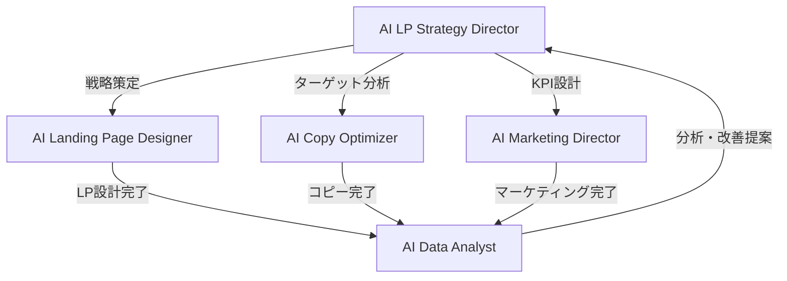

# 🎯 CV獲得ランディングページ制作チーム 完全ガイド

**AI Agents Miyabi** の CV獲得ランディングページ制作特化チームの使用方法・稼働方法の完全ガイドです。

## 📋 目次

- [概要](#概要)
- [チーム構成](#チーム構成)
- [セットアップ・準備](#セットアップ準備)
- [基本的な使用方法](#基本的な使用方法)
- [業界別テンプレート活用](#業界別テンプレート活用)
- [カスタムプロジェクト実行](#カスタムプロジェクト実行)
- [段階的実行方法](#段階的実行方法)
- [最適化・A/Bテスト](#最適化abテスト)
- [トラブルシューティング](#トラブルシューティング)
- [応用・カスタマイズ](#応用カスタマイズ)

---

## 🎪 概要

### CV獲得ランディングページ制作チームとは？

高コンバージョン率のランディングページ制作に特化した5つのAIエージェントが協働する統合チームです。

**🎯 主要機能**
- **戦略立案**: ターゲット分析・競合分析・KPI設計
- **LP制作**: 設計・CVR最適化・A/Bテスト設計
- **コピー最適化**: ヘッドライン・CTA・感情トリガー
- **マーケティング**: 集客戦略・チャネル最適化
- **分析・改善**: リアルタイム監視・パフォーマンス分析

**📊 期待成果**
- CVR向上: **3-5倍改善**
- 制作効率: **90%時間短縮**
- A/Bテスト: **自動化で10倍高速化**
- ROI: **投資回収2-4ヶ月**

---

## 🤖 チーム構成

### エージェント詳細

| エージェント | 役割 | 主要機能 |
|------------|------|----------|
| **AI LP Strategy Director** | 戦略総監督 | CV戦略立案・ターゲット分析・競合分析・KPI設計・チーム統括 |
| **AI Landing Page Designer** | LP設計専門家 | LP設計・CVR最適化・A/Bテスト・ヒートマップ分析・モバイル最適化 |
| **AI Copy Optimizer** | コピー最適化専門家 | ヘッドライン最適化・価値提案・感情トリガー・CTA最適化・緊急性表現 |
| **AI Marketing Director** | マーケティング統括 | 集客戦略・チャネル最適化・予算配分・流入経路設計 |
| **AI Data Analyst** | 分析・改善専門家 | KPIダッシュボード・パフォーマンス分析・改善提案・レポート自動化 |

### ワークフロー



---

## 🔧 セットアップ・準備

### 1. 環境確認

```bash
# プロジェクトディレクトリに移動
cd /Users/y/ai-agents-miyabi

# Node.js バージョン確認（推奨: v18以上）
node --version

# 依存関係確認
npm list --depth=0
```

### 2. 必要ファイル確認

```
/Users/y/ai-agents-miyabi/
├── src/
│   ├── agents/
│   │   ├── business/AILPStrategyDirectorAgent.ts
│   │   └── creative/AICopyOptimizerAgent.ts
│   ├── teams/CVLandingPageTeam.ts
│   └── templates/CVOptimizationTemplates.ts
├── examples/cv-landing-page-example.ts
├── scripts/run-cv-team.js
└── run-cv-demo.mjs
```

### 3. 動作確認

```bash
# クイックデモ実行（推奨）
node run-cv-demo.mjs

# 業界別テンプレート確認
node run-cv-demo.mjs --templates

# 使用方法ガイド表示
node run-cv-demo.mjs --usage
```

---

## 🚀 基本的な使用方法

### 1. 最もシンプルな実行方法

```bash
# 基本デモ実行
node run-cv-demo.mjs

# 特定情報のみ表示
node run-cv-demo.mjs --templates    # 業界別テンプレート
node run-cv-demo.mjs --patterns     # CVR最適化パターン
node run-cv-demo.mjs --tests        # A/Bテスト優先順位
node run-cv-demo.mjs --project      # プロジェクト実行シミュレーション
```

### 2. プログラムでの基本使用

```typescript
import { CVLandingPageTeam } from './src/teams/CVLandingPageTeam.js';

// チーム初期化
const cvTeam = new CVLandingPageTeam();

// 基本プロジェクト設定
const projectInput = {
  projectName: "サンプルLP制作",
  businessGoal: {
    primaryObjective: 'trial-signup', // 'trial-signup' | 'purchase' | 'consultation' | 'signup' | 'download'
    targetCVR: 5.0,                   // 目標コンバージョン率
    targetCV: 1000,                   // 目標コンバージョン数
    timeframe: '3months',             // 期間
    industry: 'B2B-SaaS',            // 業界
    productType: 'B2B-SaaS'          // 商品タイプ
  },
  targetMarket: {
    primarySegment: 'IT部門責任者',
    demographics: { ageRange: '35-50歳', income: '800-1200万円' },
    painPoints: ['業務非効率', '属人化リスク'],
    motivations: ['効率化', 'コスト削減']
  },
  budget: {
    total: 5000000,                   // 総予算（円）
    allocation: {
      development: 2000000,           // 開発費
      advertising: 2500000,           // 広告費
      tools: 300000,                  // ツール費
      testing: 200000                 // テスト費
    }
  },
  timeline: {
    phases: [
      { name: '戦略立案', duration: '1week', deliverables: ['戦略書', 'KPI設計'] },
      { name: 'LP制作', duration: '2weeks', deliverables: ['LP設計', '最適化案'] }
    ]
  }
};

// プロジェクト実行
const result = await cvTeam.executeProject(projectInput);
console.log('プロジェクト完了:', result);
```

---

## 🏢 業界別テンプレート活用

### 対応業界

| 業界 | 目標CVR | 主要目標 | 主な特徴 |
|------|---------|----------|----------|
| **B2B-SaaS** | 5.5% | 無料トライアル獲得 | ROI重視・信頼性・スケーラビリティ |
| **Ecommerce** | 3.2% | 商品購入 | 視覚訴求・緊急性・レビュー活用 |
| **Education** | 4.8% | コース申込 | 成果重視・専門性・キャリア向上 |
| **Healthcare** | 6.2% | 診療予約 | 信頼性・専門性・安心感 |
| **Financial** | 7.8% | 無料相談 | リスク軽減・専門性・透明性 |

### 業界別テンプレート使用例

```typescript
import { CVOptimizationTemplates } from './src/templates/CVOptimizationTemplates.js';

// 1. 業界テンプレート取得
const template = CVOptimizationTemplates.getIndustryTemplate('B2B-SaaS');

console.log(`目標CVR: ${template.targetCVR}%`);
console.log(`主要メッセージ:`, template.keyMessages);
console.log(`CTA パターン:`, template.ctaPatterns);
console.log(`緊急性テクニック:`, template.urgencyTechniques);

// 2. プロジェクトに適用
const projectInput = {
  projectName: "SaaS LP制作",
  businessGoal: {
    primaryObjective: template.primaryCVGoal,
    targetCVR: template.targetCVR,
    // ...その他設定
  },
  // テンプレートの推奨設定を適用
};
```

### 業界別実行例

```bash
# B2B-SaaS向けLP制作
node scripts/run-cv-team.js --industry=B2B-SaaS --goal=trial-signup --cvr=5.5

# Ecommerce向けLP制作
node scripts/run-cv-team.js --industry=Ecommerce --goal=purchase --cvr=3.2

# Education向けLP制作
node scripts/run-cv-team.js --industry=Education --goal=course-signup --budget=3000000

# Healthcare向けLP制作
node scripts/run-cv-team.js --industry=Healthcare --goal=appointment-booking --cvr=6.2

# Financial向けLP制作
node scripts/run-cv-team.js --industry=Financial --goal=consultation-request --cvr=7.8
```

---

## 🎨 カスタムプロジェクト実行

### 詳細設定例

```typescript
const customProject = {
  projectName: "AI営業支援SaaS無料トライアル獲得LP",
  
  businessGoal: {
    primaryObjective: 'trial-signup',
    targetCVR: 5.5,
    targetCV: 1000,
    timeframe: '3months',
    industry: 'B2B-SaaS',
    productType: 'B2B-SaaS'
  },
  
  targetMarket: {
    primarySegment: 'IT・営業部門責任者',
    demographics: {
      ageRange: '35-50歳',
      income: '800-1200万円',
      jobTitle: '部長・課長・マネージャー',
      companySize: '従業員100-1000名'
    },
    painPoints: [
      '営業活動の属人化',
      'リード管理の煩雑さ',
      '売上予測の困難',
      '営業効率の低さ'
    ],
    motivations: [
      '営業生産性向上',
      'データドリブン営業',
      '売上予測精度向上',
      'チーム管理効率化'
    ]
  },
  
  budget: {
    total: 5000000,
    allocation: {
      development: 2000000,   // 40%
      advertising: 2500000,   // 50%
      tools: 300000,          // 6%
      testing: 200000         // 4%
    }
  },
  
  timeline: {
    phases: [
      {
        name: '戦略立案フェーズ',
        duration: '1week',
        deliverables: ['CV戦略書', 'ターゲット分析', 'KPI設計', '競合分析']
      },
      {
        name: 'LP制作フェーズ',
        duration: '2weeks',
        deliverables: ['LP設計', 'CVR最適化案', 'A/Bテスト設計']
      },
      {
        name: 'コピー最適化フェーズ',
        duration: '1week',
        deliverables: ['ヘッドライン最適化', '価値提案', 'CTA最適化']
      },
      {
        name: 'マーケティング戦略フェーズ',
        duration: '1week',
        deliverables: ['集客戦略', 'チャネル最適化', '予算配分']
      },
      {
        name: '分析・測定設定フェーズ',
        duration: '3days',
        deliverables: ['KPIダッシュボード', '分析設定', '改善提案']
      }
    ]
  },
  
  // 現在のパフォーマンス（既存LPがある場合）
  currentPerformance: {
    currentCVR: 2.1,          // 現在のCVR
    currentTraffic: 5000,     // 現在の月間流入数
    currentCV: 105            // 現在の月間CV数
  }
};

// 実行
const result = await cvTeam.executeProject(customProject);
```

### コマンドライン実行オプション

```bash
# 基本オプション
node scripts/run-cv-team.js [オプション]

# プロジェクト設定オプション
--name=プロジェクト名          # プロジェクト名
--industry=業界               # B2B-SaaS/Ecommerce/Education/Healthcare/Financial
--goal=目標                   # trial-signup/purchase/consultation/signup/download
--cvr=数値                    # 目標CVR (%)
--target=数値                 # 目標CV数
--budget=金額                 # 総予算 (円)
--timeframe=期間              # 3months/6months/1year
--segment=ターゲット層        # ターゲットセグメント

# 実行モードオプション
--demo                        # デモプロジェクト実行
--step-by-step               # 段階的実行
--templates                   # テンプレート一覧表示
--help                        # ヘルプ表示

# 使用例
node scripts/run-cv-team.js --name="新商品LP" --industry=Ecommerce --goal=purchase --cvr=3.5 --budget=3000000
```

---

## 🔄 段階的実行方法

### Phase-by-Phase 実行

複雑なプロジェクトや段階的な確認が必要な場合に使用します。

```typescript
const cvTeam = new CVLandingPageTeam();
const projectInput = { /* プロジェクト設定 */ };

// Phase 1: 戦略立案
console.log('📋 Phase 1: 戦略立案中...');
const strategy = await cvTeam.planStrategy(projectInput);
console.log('✅ 戦略立案完了:', strategy);

// Phase 2: LP設計・制作
console.log('🎨 Phase 2: LP設計・制作中...');
const landingPage = await cvTeam.designLandingPage(projectInput, strategy);
console.log('✅ LP設計完了:', landingPage);

// Phase 3: コピー最適化
console.log('✍️ Phase 3: コピー最適化中...');
const copyOptimization = await cvTeam.optimizeCopy(projectInput, landingPage);
console.log('✅ コピー最適化完了:', copyOptimization);

// Phase 4: マーケティング戦略
console.log('📊 Phase 4: マーケティング戦略中...');
const marketingPlan = await cvTeam.planMarketing(projectInput, strategy);
console.log('✅ マーケティング戦略完了:', marketingPlan);

// Phase 5: 分析・測定設定
console.log('📈 Phase 5: 分析・測定設定中...');
const analyticsSetup = await cvTeam.setupAnalytics(projectInput, strategy);
console.log('✅ 分析設定完了:', analyticsSetup);
```

### 進捗監視・パフォーマンス分析

```typescript
// プロジェクト進捗監視
const progress = await cvTeam.monitorProgress('project-id-001');
console.log('現在フェーズ:', progress.currentPhase);
console.log('次のマイルストーン:', progress.nextMilestone);
console.log('完了フェーズ:', progress.completedPhases);

// パフォーマンス分析（実データ投入時）
const performanceMetrics = {
  currentCVR: 3.2,
  currentTraffic: 8000,
  currentCV: 256,
  topTrafficSources: [
    { channel: 'organic', percentage: 40, cvr: 4.1 },
    { channel: 'paid', percentage: 35, cvr: 2.8 },
    { channel: 'social', percentage: 25, cvr: 2.1 }
  ]
};

const analysis = await cvTeam.analyzePerformance('project-id-001', performanceMetrics);
console.log('パフォーマンス分析:', analysis);
```

---

## 🧪 最適化・A/Bテスト

### A/Bテスト優先順位

CVOptimizationTemplatesに含まれるA/Bテスト戦略：

| 優先度 | テスト領域 | 期待インパクト | 期間 | 最小サンプル |
|--------|------------|---------------|------|--------------|
| **1** | ヘッドライン・価値提案 | **高** | 7-14日 | 1,000/バリアント |
| **2** | CTA最適化 | **高** | 5-10日 | 800/バリアント |
| **3** | ソーシャルプルーフ | 中-高 | 10-14日 | 1,200/バリアント |
| **4** | フォーム最適化 | 中 | 14-21日 | 1,500/バリアント |
| **5** | ページレイアウト | 中 | 14-28日 | 2,000/バリアント |

### A/Bテスト戦略取得・実装

```typescript
// A/Bテスト優先順位取得
const testPriorities = CVOptimizationTemplates.getABTestPriorities();

testPriorities.forEach(test => {
  console.log(`優先度 ${test.priority}: ${test.testArea}`);
  console.log(`期待インパクト: ${test.expectedImpact}`);
  console.log(`推奨期間: ${test.duration}`);
  console.log(`テスト要素: ${test.testElements.join(', ')}`);
  console.log('---');
});

// CVRパターン別最適化取得
const patterns = CVOptimizationTemplates.getCVROptimizationPatterns();

// 高単価・低頻度商品の最適化
const highValuePattern = patterns['high-value-low-frequency'];
console.log('戦略:', highValuePattern.strategy);
console.log('重要要素:', highValuePattern.optimizationElements);

// パーソナライゼーション戦略
const personalization = CVOptimizationTemplates.getPersonalizationStrategies();
console.log('流入元別最適化:', personalization['traffic-source-personalization']);
```

### CVR改善フロー

```typescript
// 1. 現在のパフォーマンス分析
const currentMetrics = {
  cvr: 2.1,
  traffic: 5000,
  conversions: 105
};

// 2. 業界ベンチマーク比較
const industryTemplate = CVOptimizationTemplates.getIndustryTemplate('B2B-SaaS');
const benchmarkCVR = industryTemplate.targetCVR; // 5.5%

const improvement = benchmarkCVR - currentMetrics.cvr; // 3.4%の改善余地
console.log(`改善余地: ${improvement}% (現在: ${currentMetrics.cvr}% → 目標: ${benchmarkCVR}%)`);

// 3. 最適化施策の実行
const optimizationFocus = industryTemplate.optimizationFocus;
optimizationFocus.forEach(focus => {
  if (focus.priority === 'high') {
    console.log(`高優先度施策: ${focus.area}`);
    console.log(`施策: ${focus.tactics.join(', ')}`);
  }
});
```

---

## 🔧 トラブルシューティング

### よくある問題と解決方法

#### 1. モジュールが見つからないエラー

```bash
Error [ERR_MODULE_NOT_FOUND]: Cannot find module
```

**解決方法:**
```bash
# TypeScriptのビルドが必要な場合
npm run build

# または直接実行
node run-cv-demo.mjs  # こちらはビルド不要

# 依存関係の確認・インストール
npm install
```

#### 2. TypeScriptコンパイルエラー

```bash
# 既存ファイルのエラーを無視して新しいファイルのみビルド
npx tsc --skipLibCheck

# または個別ファイルコンパイル
npx tsc src/teams/CVLandingPageTeam.ts --outDir dist --moduleResolution node
```

#### 3. プロジェクト設定エラー

```typescript
// 必須フィールドが不足している場合の最小設定
const minimalProject = {
  projectName: "最小設定プロジェクト",
  businessGoal: {
    primaryObjective: 'trial-signup',
    targetCVR: 5.0,
    targetCV: 1000,
    timeframe: '3months',
    industry: 'B2B-SaaS',
    productType: 'B2B-SaaS'
  },
  targetMarket: {
    primarySegment: 'ターゲット層',
    demographics: { ageRange: '30-50' },
    painPoints: ['課題1'],
    motivations: ['動機1']
  },
  budget: {
    total: 1000000,
    allocation: { development: 400000, advertising: 500000, tools: 60000, testing: 40000 }
  },
  timeline: {
    phases: [{ name: 'フェーズ1', duration: '1week', deliverables: ['成果物1'] }]
  }
};
```

#### 4. メモリ不足エラー

```bash
# Node.jsのメモリ制限を増加
node --max-old-space-size=4096 run-cv-demo.mjs

# または環境変数で設定
export NODE_OPTIONS="--max-old-space-size=4096"
node run-cv-demo.mjs
```

### デバッグ方法

```bash
# 詳細ログ出力
DEBUG=* node run-cv-demo.mjs

# 特定のチェック
node run-cv-demo.mjs --templates  # テンプレート確認
node run-cv-demo.mjs --help       # ヘルプ表示
node -v                           # Node.jsバージョン確認
npm list                          # パッケージ確認
```

---

## 🚀 応用・カスタマイズ

### 新しい業界テンプレート追加

```typescript
// src/templates/CVOptimizationTemplates.ts に追加
static getIndustryTemplate(industry: string): IndustryTemplate {
  const templates: { [key: string]: IndustryTemplate } = {
    // 既存テンプレート...
    
    // 新しい業界を追加
    'Real-Estate': {
      industry: 'Real-Estate',
      primaryCVGoal: 'property-inquiry',
      targetCVR: 8.5,
      keyMessages: [
        '立地・アクセスの良さ',
        '資産価値・投資性',
        '住環境・利便性',
        '価格・コストパフォーマンス'
      ],
      ctaPatterns: [
        {
          type: 'property-inquiry',
          text: ['物件資料を請求', '見学予約をする', '価格を確認する'],
          placement: ['hero', 'property-details', 'contact'],
          design: { color: 'luxury-gold', size: 'large', shape: 'rounded' },
          psychology: ['scarcity', 'investment-value', 'lifestyle-aspiration']
        }
      ],
      // その他設定...
    }
  };
  
  return templates[industry] || templates['B2B-SaaS'];
}
```

### カスタムエージェント追加

```typescript
// 新しい専門エージェントを追加
import { BaseAgent, AgentTask } from '../core/BaseAgent.js';

export class AIMobileOptimizationAgent extends BaseAgent {
  constructor() {
    super({
      name: 'AI Mobile Optimization Agent',
      description: 'モバイルCV最適化専門エージェント',
      capabilities: ['モバイルUX最適化', 'タッチ操作最適化', 'ページ速度最適化'],
      model: 'claude-3.5-sonnet',
      temperature: 0.3,
      maxTokens: 4000,
    });
  }

  async executeTask(task: AgentTask): Promise<any> {
    // モバイル最適化ロジック
    return {
      type: 'mobile_optimization',
      recommendations: ['タップ領域拡大', 'フォーム簡素化', '画像最適化'],
      // ...
    };
  }
}

// CVLandingPageTeamに統合
export class CVLandingPageTeam {
  private mobileOptimizer: AIMobileOptimizationAgent;

  constructor() {
    // 既存エージェント...
    this.mobileOptimizer = new AIMobileOptimizationAgent();
  }

  async executeProject(input: CVProjectInput): Promise<CVProjectOutput> {
    // 既存フロー...
    
    // モバイル最適化を追加
    const mobileOptimization = await this.optimizeForMobile(input);
    
    return {
      // 既存結果...
      mobileOptimization
    };
  }
}
```

### 独自KPI・指標追加

```typescript
// カスタムKPI設定
const customKPIs = {
  // 業界特有指標
  'subscription': ['MRR成長率', 'チャーン率', 'LTV/CAC比'],
  'ecommerce': ['AOV', 'カート放棄率', 'リピート購入率'],
  'lead-gen': ['SQL転換率', 'パイプライン価値', 'セールスサイクル'],
  
  // カスタム指標
  'engagement': ['セッション時間', 'ページ深度', 'スクロール率'],
  'quality': ['バウンス率', '直帰率', 'ブランド想起率']
};

// KPIダッシュボードカスタマイズ
const dashboardConfig = {
  primaryKPIs: customKPIs['subscription'],
  updateFrequency: 'realtime',
  alertThresholds: {
    'cvr_drop': 0.15,      // CVR 15%以上低下でアラート
    'traffic_spike': 2.0,   // トラフィック2倍以上でアラート
    'cost_increase': 1.5    // CPA 50%以上上昇でアラート
  },
  reportSchedule: {
    daily: ['cvr', 'traffic', 'conversions'],
    weekly: ['trends', 'channels', 'segments'],
    monthly: ['strategy_review', 'optimization_plan']
  }
};
```

### 外部ツール連携

```typescript
// Google Analytics 4 連携例
async function integrateGA4(projectId: string) {
  const ga4Config = {
    measurementId: 'G-XXXXXXXXXX',
    events: [
      { name: 'cv_form_start', parameters: { form_type: 'trial_signup' } },
      { name: 'cv_form_complete', parameters: { conversion_value: 1 } },
      { name: 'cta_click', parameters: { cta_position: 'hero' } }
    ],
    goals: [
      { name: 'trial_signup', value: 100 },
      { name: 'demo_request', value: 50 }
    ]
  };
  
  // GA4設定の自動生成
  return generateGA4Code(ga4Config);
}

// A/Bテストツール連携例
async function integrateOptimizelyVWO(testConfig: any) {
  const experimentConfig = {
    platform: 'optimizely', // or 'vwo'
    experiments: [
      {
        name: 'headline_test',
        variations: ['control', 'variation_a', 'variation_b'],
        allocation: [34, 33, 33],
        duration: 14
      }
    ]
  };
  
  return generateExperimentCode(experimentConfig);
}
```

---

## 📊 成果測定・レポート

### 自動レポート生成

```typescript
// 定期レポート設定
const reportConfig = {
  frequency: 'weekly',
  recipients: ['marketing@company.com', 'ceo@company.com'],
  format: 'pdf_and_dashboard',
  sections: [
    'executive_summary',
    'key_metrics',
    'conversion_funnel',
    'traffic_analysis',
    'optimization_recommendations',
    'next_week_plan'
  ]
};

// レポート生成実行
const weeklyReport = await cvTeam.generateReport('project-001', reportConfig);
```

### ROI計算・予測

```typescript
// ROI分析
const roiAnalysis = {
  investment: {
    development: 2000000,
    advertising: 2500000,
    tools: 300000,
    total: 4800000
  },
  results: {
    additional_conversions: 750,  // 追加CV数
    conversion_value: 8000,       // CV単価
    total_revenue: 6000000,       // 総売上増加
    net_profit: 1200000          // 純利益
  },
  timeframe: '6months',
  roi_percentage: 25,             // ROI 25%
  payback_period: '2.4months'     // 投資回収期間
};
```

---

## 🎯 まとめ

### チーム活用のベストプラクティス

1. **段階的アプローチ**: 小規模テストから開始し、段階的にスケールアップ
2. **データドリブン**: 必ず実データに基づいてPDCAサイクルを回す
3. **業界特化**: 自社の業界テンプレートを基準に最適化
4. **継続改善**: A/Bテストを継続的に実施し、常に改善
5. **チーム連携**: 各エージェントの専門性を活かした協働

### 次のステップ

1. **基本デモ実行**: `node run-cv-demo.mjs` で動作確認
2. **業界テンプレート確認**: 自社に最適な業界テンプレートを特定
3. **パイロットプロジェクト**: 小規模なテストプロジェクトで効果検証
4. **本格運用**: 成果確認後、本格的なLP制作・最適化に活用
5. **継続改善**: 定期的な分析・最適化でCVRを継続向上

---

## 📞 サポート・問い合わせ

### ドキュメント・リソース

- **実行例**: `examples/cv-landing-page-example.ts`
- **テンプレート詳細**: `src/templates/CVOptimizationTemplates.ts`
- **チーム詳細**: `src/teams/CVLandingPageTeam.ts`

### トラブル時の対応

1. **クイックデモ実行**: `node run-cv-demo.mjs --help`
2. **エラーログ確認**: 詳細なエラーメッセージを確認
3. **環境確認**: Node.js バージョン・依存関係の確認
4. **段階的デバッグ**: 各フェーズごとの動作確認

**CV獲得ランディングページ制作チームで、高コンバージョンLPを効率的に制作しましょう！** 🎯✨